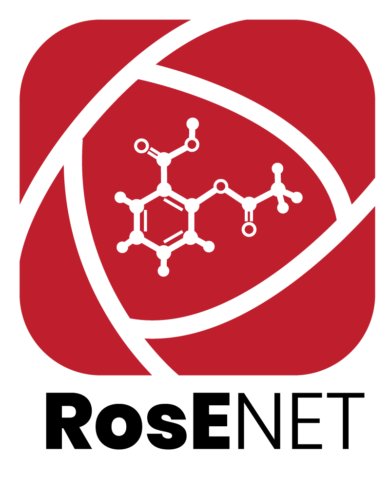

# RosENet

This is the repository for the RosENet project.

RosENet: A 3D Convolutional Neural Network for predicting absolute binding affinity using molecular mechanics energies

Hussein Hassan-Harrirou¹, Ce Zhang¹, Thomas Lemmin <sup>1,2,*</sup>

¹DS3Lab, System Group, Department of Computer Sciences, ETH Zurich, CH-8092 Zurich, Switzerland

²Institute of Medical Virology, University of Zurich (UZH), CH-8057 Zurich, Switzerland

\*corresponding author: thomas.lemmin@inf.ethz.ch

## Prerequisites

The following Python libraries are needed:

- prody
- htmd
- pyrosetta
- tensorflow

Additionally, the Rosetta Commons framework is needed. After installing it (not shown here), the path to the root folder of the installation must be set in file constants.py

## How to run

This repository is built as a Python module. To execute it, one should go above the root folder and run the following command:

```
python3 -m DrugDiscovery -- arguments
```

Currently, six actions are implemented:

1. preprocess
2. voxelize
3. postprocess
4. train
5. evaluate
6. predict

These actions are also thought to be executed in this order.
Preprocessing will compute the file transformations and energy minimization on the text files.
Voxelization allows to create the 3D images for HTMD, Rosetta and electronegativity features and combine them.
Postprocessing will transform the 3D images into a TFRecords format to be used as input for the neural networks.
Training, evaluation and prediction have the usual meanings.

## Folder structure

To ease the setup, there are some requirements to the structure of the inputs.
The coarse unit of work is the dataset. A dataset is a folder with pdb folders and a file called labels.
The next unit of work is the pdb folder. A pdb folder stores a {code}_protein.pdb file and a {code}_ligand.mol2.
The labels file stores a line per pdb folder with the binding affinity assigned to it, separated by a space


A valid folder structure:
```
test_dataset\
             10gs\
                  10gs_protein.pdb
                  10gs_ligand.mol2
             labels
```

A valid `labels` file:
```
10gs 12
```

## Neural networks

There are three CNNs implemented in the module, but any other implementation can be used. The only requirement is following TensorFlow's Estimator API.
It is easy to replicate the same structure as the ones given here.

After training a neural network, the module will save the trained network in the dataset folder, with the essential parameters also written in the folder name. Additionally, a line with the minimal validation error and the epoch when it was achieved will be saved in a results file in the dataset folder. The random seed used during training will also be stored in this line. This seed will be necessary to load the network afterwards. 

## Selecting feature subsets

To select feature subsets, we can use the channel selectors. Right now, only basic selectors are implemented. These selectors are used during the training, evaluation or prediction actions.
The current accepted selectors are "htmd", "rosetta", and "electronegativity". To select a combination, we can concatenate them with an underscore.
For example, "htmd_electronegativity" would combine both HTMD and electronegativity features.
To see where to use the channel selector, see the examples below.

## Setting the randomness

The neural network actions use a seed parameter. For training, this seed is optional and can be randomly chosen by the module.
This seed will affect not only the network, but where the trained neural network is saved. Thus, it is necessary to use the same seed to load the previously produced network.

## Settings

There are a few parameters that may be modified to change the behavior of the module. The file settings.py stores these options.
There we can change the voxelization methods and the size of the voxel image. We can also change the parameters for TensorFlow's input pipeline.

## Examples

To run the actions mentioned above with the example dataset, we need to run the following commands:

1. preprocess
```
python3 -m DrugDiscovery -- preprocess test_dataset
```
2. voxelize
```
python3 -m DrugDiscovery -- voxelize test_dataset
```
3. postprocess
```
python3 -m DrugDiscovery -- postprocess test_dataset
```
4. train
```
python3 -m DrugDiscovery -- train train_dataset validation_dataset model.py "htmd_rosetta_electronegativity" 1000
```
5. evaluate
```
python3 -m DrugDiscovery -- evaluate train_dataset evaluation_dataset model.py "htmd_rosetta_electronegativity" 1000
```
6. predict
```
python3 -m DrugDiscovery -- predict train_dataset prediction_dataset model.py "htmd_rosetta_electronegativity" 1000
```
